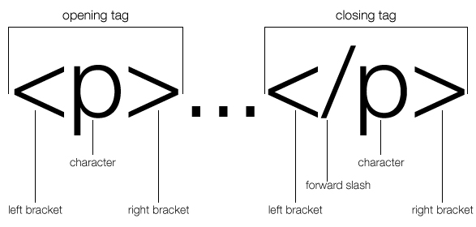



# 101 Intro to Web Pre-work
* Bring your questions to student orientation.
* Pre-work for other classes can be found in your class textbook by signing into our Campus Manager platform.

#### Prepare your Machine
You'll need 3 essential utilities: a **web browser**, a **text editor**, and a **terminal emulator** (AKA Command Line Interface).
1. Install [Google Chrome](https://support.google.com/chrome/answer/95346?co=GENIE.Platform%3DDesktop&hl=en-GB)
  - Chrome is a robust browser with fantastic development tooling, as you'll soon find out.
2. Install [Atom](http://atom.io/). [Video: How to install Atom.](https://youtu.be/8sIwQabXSM8)
  - Atom is GitHub's official open source text editor. It is easy to set up and highly customizable.
  - The default *font* and *color scheme* in Atom are highly functional. If you choose to customize the font, we ask that you make sure to only use a `monospace` font optimized for readability. [Here's](http://wesbos.com/programming-fonts/) a list of good options.
3. Install your first atom extension: `atom-live-server`
  * [Video: How to install Atom extensions](https://youtu.be/qeMMO7wkecs)
4. Install a **terminal emulator** depending on your OS of choice:

macOS | Windows | Linux
--------------|------------|-------
Use your terminal | Install Gitbash - which happens automatically when you install git| The default terminal in both GNOME and KDE will be more than sufficient.
Download Homebrew [Homebrew](https://brew.sh/). Brew will come in handy if you run into any snags during environment setup. | Move to the next step. | Move to the next step.
Install Git by typing this command into your terminal: `brew install git` | [Install git](https://git-for-windows.github.io/) | Use your package manager to install the latest version of [Git](https://git-scm.com/): ```sudo apt-get install git```

#### Prepare your Mind

* Complete Language Skills:
  * [HTML/CSS](https://www.codeschool.com/learn/html-css)
  * Just complete Lesson 1
  * Don't pay for anything

* Complete Development Skills:
  * [Egghead.io - Chrome DevTools](https://egghead.io/courses/using-chrome-developer-tools-elements)
  * [Learn Git in 15 Minutes](https://try.github.io/levels/1/challenges/1)
  * [Watch this short DevTips series about Git](https://www.youtube.com/watch?v=1h9_cB9mPT8&list=PLqGj3iMvMa4LFz8DZ0t-89twnelpT4Ilw). You can skip the third video (Using GitHub Desktop).

If you feel overwhelmed or don't understand what's going on - don't worry! That's what we're here for.

As you work through the Pre-Work, we ask that you:

1. Jot down your questions. Keep a record of what you're not understanding. We'll be reviewing these in class on day one.
2. Google everything you're not understanding. When you find something that you find useful, **bookmark it to an appropriate folder**.
  * Let's say you're struggling to grasp *floats* in CSS.
  * After a bit of Googling, you find a good resource.
  * Bookmark the page (`⌘ + d` / `control + d`), and in this dialogue box, either *select* a corresponding bookmarks folder from the dropdown menu or *create* a new one:

#### Prepare your Career

* Prepare new resume.
* Identify target roles.
* Work on developing needed skills.
* Create or update [LinkedIn](https://www.linkedin.com/) with a picture/bio.

#### Prepare your Github

* Create an account on [GitHub](http://www.github.com) using your real name. Please choose a *normal* username - this is, after all, something that you'll be sending to your future employers.

<iframe width="420" height="315" src="https://www.youtube.com/embed/l5c2MXy7aOU" frameborder="0" allowfullscreen></iframe>


#### Study for the first day of class:

## How to obtain your `web-workbook` using `git`

* Make sure pre-work is completed.
* Review the [DevTips GitHub For Noobs](https://www.youtube.com/watch?v=1h9_cB9mPT8&list=PLqGj3iMvMa4LFz8DZ0t-89twnelpT4Ilw) series.

* Establish first Pull Request:

  1. Fork `web-workbook` from the [@AustinCodingAcademy GitHub](https://github.com/AustinCodingAcademy/web-workbook).
  2. You'll be redirected to your forked version of the `web-workbook`. Now, click the **Clone or download** button and copy the URL provided in the dropdown dialog.
  3. In your terminal, navigate to Documents.
  ```shell
  cd ~/Documents
  ```
  4. If you prefer, create a new folder for your development projects:
  ```shell
  mkdir Dev
  cd Dev
  ```
  5. Now, `clone` the `web-workbook` repository using the URL you grabbed from your forked repo on GitHub:
  ```shell
  git clone _______ (paste the URL here)
  ```
  5. Open the `web-workbook` with Atom:
  ```shell
  cd web-workbook
  atom .
  ```
  6. Make your first change to `lesson 1/resume/index.html`:

  Change:
  ```html
  <title>Resume</title>
  ```
  To:
  ```html
  <title>(your name here)'s Resume</title>
  ```
  Then **Save**.

7. Now we'll **add** your changes to the staging area, **commit** them and, finally, **push** the changes up to GitHub. In your Terminal, do:
```shell
git add -A
git commit -m "Add first changes"
git push origin gh-pages
```
10. Confirm your changes were pushed correctly by looking at your forked `web-workbook` on GitHub. You should see your commit message in the blue title bar just below the **Clone or download** button.
11. Follow the instructor's instructions to make your first pull request.

## Model-View-Controller (MVC) Architecture

Modern web applications are constructed according to a design paradigm known as [MVC](https://en.wikipedia.org/wiki/Model%E2%80%93view%E2%80%93controller).

We will begin learning web application development by starting with HTML/CSS, in order to familiarize ourselves with the **View** in **MVC**.

For the sake of an example, let's compare this to a real-world scenario: **building a house in a planned community**.
- Writing **HTML** is akin to building the **structure** of a house - screwing together 2 x 4's to construct a solid frame.
- Using **CSS**, we can style our **HTML** to our liking - in our hypothetical house, positioning windows, painting walls, laying down a welcome mat.

In Intermediate, we'll take a deeper look at JavaScript, the de facto programming language of the web.
- JavaScript allows us to add **dynamic functionality** to ordinary, **static** HTML/CSS *views*. Our house can now have light switches, a garage door, automatic thermostat and more - thanks to the flexible extensibility of JS and a handy library called [jQuery](http://jquery.com).
- We can also use JavaScript (via jQuery) to request information over the Internet, then format and display that information on our webpage. This is somewhat comparable to ordering a piece furniture from IKEA - you ask for the parts you need, then figure out how to put it all together.

In the Advanced class, we'll put it all together to build full stack applications. We'll have to supercharge our house example to try and illustrate what this looks like.
- Pretend that instead of a house we're building a **model home**. **Users** come and visit your model home in order to decide how they'd like to customize their own *versions* of the model home.
- With a firm grasp of JavaScript under our belts, we can use a sophisticated framework called [React](https://facebook.github.io/react) to **procedurally generate** the HTML/CSS we previously wrote by hand. If your **users** want to customize the model-home / view's color scheme, you can use React to *render* buttons and sliders that allow for those changes. Notice, here, that we're still only working with the **V** in **MVC**.
- React also provides clean, efficient tooling for managing the choices your user makes. Let's say a user wants to see the model home's `background-color` change from *yellow* to *blue* -  you can use React to take this new preference and send it somewhere to be *saved*.

This last part raises an important question:

> "Where are we going to *save* that new color preference? We certainly don't want to save over the original **model home**..."

Indeed, we need to separate the **view**'s original settings from the user's custom preferences, and then save those preferences so the user can come back to them later. This is where the other two aspects of MVC come into play.

- We'd use a **database** to hold both the **original *Model* home** (pun intended), as well as the **user-customized version(s)** of the original model home.
- We'd use a **server** to **"Control"** the user's changes - that is, to receive the **requests an ordinary user makes**, then decide what kind of changes that ordinary user can make. A user should be able to customize his or her own version of the model home, but shouldn't be allowed to make unauthorized changes to other users' model homes. We would use a **Controller** to *restrict* a normal user's *access* accordingly.

To summarize, full stack applications are defined by this **MVC** design paradigm - the proper implementation of a dynamic *Front-End* with a well-structured *Back-End*.

Here's a simple example of a full stack application:

[MVC Demo](http://todomvc.com/examples/react/#/)

Don't expect yourself to have mastered MVC architecture by now (we won't expect it either). The cursory overview written above is meant to give you a better idea of where you're headed. So with that in mind, let's get started.

## HTML

From wikipedia:
> [HyperText Markup Language (HTML)](https://en.wikipedia.org/wiki/HTML) is the standard markup language for creating web pages and web applications. With Cascading Style Sheets (CSS), and JavaScript, it forms a triad of cornerstone technologies for the World Wide Web. Web browsers receive HTML documents from a webserver or from local storage and render them into multimedia web pages. HTML describes the structure of a web page semantically and originally included cues for the appearance of the document.

Does any of that sound familiar? Already we see concepts of MVC coming into play!

### Essential tags and elements *required* for a webpage

* `<!DOCTYPE html>`
* `<html>...</html>`
* `<head>...</head>`
* `<title>...</title>`
* `<body>...</body>`

When we put them all together it looks like this:

```html
<!DOCTYPE html>
<html>
  <head>
    <title></title>
  </head>
  <body>
  </body>
</html>
```

It doesn't look like much, but the important thing to note here is that it meets the *minimum requirements* necessary in order to be rendered as a webpage.

**Note how elements are *nested* inside other elements. `title`, for example, is *nested* within the `head`**

## HTML element structure


### Playing with the code

Use [JSBin](http://jsbin.com) to follow along, adding these elements in the `<body>`. Use the HTML pane to add the elements to the template they've provided.

* `<div></div>`
* `<p></p>`
* ``
* `<a></a>`

A `<div>` will allow us to group or encapsule common elements on a page. A `<p>` is meant to hold text in groups of 'paragraphs'. The `` needs a `src` attribute to provide the image we want to display, written as ``. Similarly, the anchor tag `<a>` needs an `href` attribute - a _**h**ypertext **ref**erence_ - if we want it to link to another location.

## Semantic Elements

A _semantic_ element clearly describes its meaning to both the browser **and** to the developer - that is, the original developer, and any developers who work on the project in the future.

One of the benefits of writing HTML semantically is that it's easy-to-use. The use of semantic HTML elements provides a developer the combined advantage of writing fewer attributes while avoiding inline styles.

All of this makes your code look and feel more structured. Whenever any future developers read or edit your code, they will have an easier time comprehending it since they won't have to waste time figuring out how it works. Plus, your code will be simpler and more condensed.

### Sectioning Elements


```html
<body>
  <header><h1>My Awesome Blog!</h1></header>
  <nav>Home<br>About<br>Events<br>Contact</nav>
  <main>
    <section>
      <h1>Posts</h1>
      <article>My First Post!</article>
      <article>My Second Post!</article>
      <article>My Third Post!</article>
    </section>
    <section>
      <h1>Calendar</h1>
      <table>...</table>
    </section>
  </main>
  <aside>You Win!!!</aside>
  <footer>© 2016 Austin Coding Academy</footer>
</body>
```

The [`<header>`](https://developer.mozilla.org/en-US/docs/Web/HTML/Element/header) element represents a group of introductory or navigational aids. It may contain some heading elements but also other elements like a logo, wrapped section's header, a search form, and so on.

A [`<nav>`](https://developer.mozilla.org/en-US/docs/Web/HTML/Element/nav) element (HTML Navigation Element) represents a section of a page that links to other pages or to parts within the page: a section with navigation links.

The [`<main>`](https://developer.mozilla.org/en-US/docs/Web/HTML/Element/main) element represents the main content of  the <body> of a document or application. The main content area consists of content that is directly related to, or expands upon the central topic of a document or the central functionality of an application.

A [`<section>`](https://developer.mozilla.org/en-US/docs/Web/HTML/Element/section) element represents a generic section of a document, i.e., a thematic grouping of content, typically with a heading. Each `<section>` should be identified, typically by including a heading (`<h1>`-`<h6>` element) as a child of the `<section>` element.

The [`<article>`](https://developer.mozilla.org/en-US/docs/Web/HTML/Element/article) element represents a self-contained composition in a document, page, application, or site, which is intended to be independently distributable or reusable.

The [`<aside>`](https://developer.mozilla.org/en-US/docs/Web/HTML/Element/aside) element represents a section of the page with content connected tangentially to the rest, which could be considered separate from that content. These sections are often represented as sidebars or inserts.

The [`<footer>`](https://developer.mozilla.org/en-US/docs/Web/HTML/Element/footer) element represents a footer for its nearest sectioning content or sectioning root element. A footer typically contains information about the author of the section, copyright data or links to related documents.

### `<h1>`s within `<section>`s
A `<h1>` tag should be used to name what the content in the current sectional semantic element is about. It will auto adjust with the amount of nesting the section has. Notice what happens in the Codepen embedded below:

<p data-height="441" data-theme-id="0" data-slug-hash="OXZaLV" data-default-tab="html,result" data-user="mistakevin" data-embed-version="2" class="codepen" editable="true">See the Pen <a href="http://codepen.io/mistakevin/pen/OXZaLV/">OXZaLV</a> by Kevin Colten (<a href="http://codepen.io/mistakevin">@mistakevin</a>) on <a href="http://codepen.io">CodePen</a>.</p>
<script async src="//assets.codepen.io/assets/embed/ei.js"></script>

It's worth noting that this is **not** a semantically appropriate way of achieving this effect. As a rule of thumb, start with `h1` and work your way down to `h6`, using CSS to achieve the desired aesthetic effect.

### Other benefits
Many of us only consume the web through the web browser, but there is a significant portion of the world that does not. Many users rely on screen readers,  monochrome displays or other assistant technologies. Others will expect a page to be printer-friendly in order for it to be of any use. In these cases we not only concern our design sensibilities with how content is presented, but with how it is _structured_. We compose our HTML _semantically_ so that it renders accurately across a range of browsing platforms - even before adding any CSS styling.

#### CSS Anatomy

CSS consists of 2 components: selector and declaration.
* **Selector** - selects the element to change
* **Declaration** - changes to style of the element

The declaration consists of 2 parts: a property and a value.
* **Properties** - indicates what you want to change (color, width, height, font, etc.)
* **Values** - specifies how it will change (color: blue, red, etc.)



### Cascading and Inheritance
When you style an element, you can use many different possible methods in order to achieve a desired result. Under the hood, CSS relies on a specific '_order of inheritance_' to determine which methods end up affecting how your element is rendered by _prioritizing some methods over others_. This complex interaction makes CSS powerful, but it can also make it confusing and difficult to debug.

There are three main sources of style information that form a [cascade](https://developer.mozilla.org/en-US/docs/Web/Guide/CSS/Getting_Started/Cascading_and_inheritance). In order of loading order (that is, which styling loads first), they are:

1. **The browser's default styles for the markup language. (ex. Chrome or Firefox built-in defaults)**
1. **Styles specified by a user who is reading the document. (ex. Maybe a user set some custom settings somewhere)**
1. **The styles linked to the document by its author. (This is what we can control)**

These can be specified in three places:

#### In an external file
This method is considered *best practice* - we'll be using it throughout this course.

  ```html
  <head>
    <title>Awesome website</title>
    <link rel="stylesheet" href="path/to/your/css-file.css">
  </head>
  ```
#### In a `<style>` definition at the beginning of the document
Use this method **solely** for styles that are used only within a particular page.

  ```html
  <head>
    <title>Adding CSS using style element</title>
    <style>
    h1 {
      text-decoration: underline;
      font-family: 'Arial', sans-serif;
    }
    </style>
  </head>
  ```
#### On a specific element in the body of the document
This is known as _inline styling_. It is the **least maintainable** method, but can be used for testing.

  ```html
  <section style="width: 500px; height: 256px; background:#ccc;"></section>
  ```

#### Take 10 minutes to play around with this CodePen.
For the sake of brevity, we are going to leave out the `<DOCTYPE>`, `<html>`, `<head>`, `<body>` tags in the CodePen examples, but be sure to put them in your own files!

<p data-height="265" data-theme-id="0" data-slug-hash="GqLzyR" data-default-tab="html,result" data-user="mistakevin" data-embed-version="2" data-editable="true" class="codepen">See the Pen <a href="https://codepen.io/mistakevin/pen/GqLzyR/">GqLzyR</a> by Kevin Colten (<a href="http://codepen.io/mistakevin">@mistakevin</a>) on <a href="http://codepen.io">CodePen</a>.</p>
<script async src="//assets.codepen.io/assets/embed/ei.js"></script>

### CSS Selectors
In a style definition, the type of **selector** we use determines which element(s) are or are not going to be affected.
#### There are five types of selectors:
* _types_
* _ids_
* _classes_
* _attributes_
* _pseudo-classes_

#### Type Selectors
The `type selector` simply selects any element specified by its type. Unless you modify it with additional selections, a type selector will affect every instance of that type. If you write one `a` selector, you would then change the styling for every `a` element within the page. Because of this, type selectors are usually reserved for doing just that:

```html
<a href="#">link</a>
```

```css
a {
  text-decoration: none; // removes the underline
}
```

#### ID Selectors
The `id` selector is used for a unique element, which means that the `id` should only be used **one time**, on **one element**, per page. Simply add an id `attribute` and a value.

```html
<div id="mario"></div>
```

```css
#mario {
  color: red;
}
```

#### Class selectors
The `class` selector is very similar to the `id` selector, but `class` can be shared with more elements. You can apply classes multiple times on a page to any element you want.

```html
<div class="luigi"></div>
<!-- more html -->
<section class="luigi"></section>
```

```css
.luigi {
  color: green;
}
```

#### Attribute Selectors
You are not restricted to the two attributes, `class` and `id`. You can specify other element-specific attributes by using `[square brackets]`. Inside the brackets you put the attribute name, optionally followed by a matching operator and a value.
```html
<a disabled>I'm a disabled link!</a>

<input type="button">
```

```css
[disabled] {
  color: gray;
}

[type="button"] {
  font-size: 16px;
}
```

#### Pseudo-class selectors
A CSS [pseudo-class](https://developer.mozilla.org/en-US/docs/Web/CSS/Pseudo-classes) is a keyword added to selectors that specifies a special *characteristic* or *state* of the element in question. For example `:hover` will apply a style when the user's mouse hovers over the element specified by the selector. These special state attributes won't be explicitly written in HTML, but are present nonetheless, ready to be manipulated using CSS.

```css
selector:pseudo-class {
  property: value;
}
```

<p data-height="235" data-theme-id="0" data-slug-hash="grVaJL" data-default-tab="html,result" data-user="mistakevin" data-embed-version="2" class="codepen">See the Pen <a href="http://codepen.io/mistakevin/pen/grVaJL/">grVaJL</a> by Kevin Colten (<a href="http://codepen.io/mistakevin">@mistakevin</a>) on <a href="http://codepen.io">CodePen</a>.</p>
<script async src="//assets.codepen.io/assets/embed/ei.js"></script>

### How some selectors appear in code:

#### Type selector

```html
<p>This is a paragraph that contains <span>several span tags</span>. I'd like to style these span tags across my <span>entire site at once</span>, to establish a default  site-wide format for them. The most efficient selector for this would be the <span>element selector</span>, as it will allow me to establish a base-line format for the span tag with a <span>low degree of specificity</span>. This means that the formatting will be controlled throughout the entire site with a single selector, and it will be <span>easy to overwrite in specific instances</span> where I want the styling to change.</p>
```

#### Class selectors
```html
<h4>Targeting class attributes</h4>
<p>In this example I want to target specific class attribute values. Note how the styling is applied regardless of element type. <em class="highlight">Class selectors are also more specific than element selectors</em>, so they allow us to overwrite the more general styles of element selectors.</p>
<h4 class="highlight">Using class selectors</h4>
<p>They also allow us to target very specific locations or instances by simply applying a <strong class="highlight">class attribute</strong>. This is a great way to write styles for specific purposes with a single selector and then apply it whenever needed by adding the appropriate class attribute.</p>
<p>Care should be taken when using class selectors as overuse of them can bloat code and create stylesheets that are hard to maintain.</p>
```

#### ID selectors
```html
<section id="overview">
  <h4>Targeting ID attributes</h4>
  <p>In this example I want to target specific ID attribute values. Note how the styling is applied regardless of element type. ID selectors are extremely specific, and will overwrite most selector types.</p>
</section>
<h4 id="strategy">Using ID selectors</h4>
<p>Many designers avoid using ID selectors and discourage their use in projects due to their highly specific nature. ID selector styling is very hard to overwrite later, and generic interface styling can fail if dropped into a region being controlled through ID selectors. Still, ID selectors can play an important role in styling sites. You simply need to develop clear rules for when they are appropriate to use and how they might impact future styles.</p>
```

#### Specificity
[Specificity](https://developer.mozilla.org/en-US/docs/Web/CSS/Specificity) is the means by which browsers decide which CSS property values are the most relevant to an element and, therefore, will be applied.

Remember this order - it is critical for understanding how to properly apply (and debug) CSS.

Least Specific||Most Specific
-|-|-
Type selectors and pseudo-elements|Class selectors, attribute selectors and pseudo-classes|ID selectors
`h1`, `:before`, etc|`.example`, `[type="radio"]`, `:hover`, etc|`#example`

Universal selectors (`*`), combinators (`+`, `>`, `~`, ' ' (space)) and negation pseudo-class (`:not()`) have no effect on specificity. (The selectors declared inside `:not()` do, however.)

Inline styles added to an element (e.g., `style="font-weight:bold"`) always overwrite any styles in external stylesheets - in a sense they can be considered to have the highest specificity.

Take a look to the following code and determine what color the paragraph is going to be. Then *uncomment* the CSS and see if you are correct!

<p data-height="265" data-theme-id="0" data-slug-hash="YWoBVj" data-default-tab="html,result" data-user="mistakevin" data-embed-version="2" data-editable="true" class="codepen">See the Pen <a href="http://codepen.io/mistakevin/pen/YWoBVj/">YWoBVj</a> by Kevin Colten (<a href="http://codepen.io/mistakevin">@mistakevin</a>) on <a href="http://codepen.io">CodePen</a>.</p>
<script async src="//assets.codepen.io/assets/embed/ei.js"></script>

### CSS Combinators

**Descendent selector** - Matches an element that is a descendant of - is *nested* inside of - another specified element. This applies to all descendants within that element. Descendant selectors are separated by a space. The right most selector is what is actually getting targeted.

```css
body h1 {
  font-size: 1.75em;
}

section .warning p {
  color: red;
  font-weight: bold;
}
```

**Child selector** - Matches an element that is a direct child of another. It will not include grandchild and down. It is more restrictive than a descendant selector. It uses a `>`.

```css
body > main {
  font-size: 1.75em;
}

section > article > h2.title {
  color: red;
  font-weight: bold;
}
```

### CSS Reset

The idea behind using a CSS reset is to reduce browser default styling like border, padding, margins and font sizes. Knowing that you are using a CSS reset gives you a starting point of defining rules for elements without having surprises.

Create a new CSS file and name it something like reset.css.

```css
html, body, div, span, applet, object, iframe,
h1, h2, h3, h4, h5, h6, p, blockquote, pre,
a, abbr, acronym, address, big, cite, code,
del, dfn, em, img, ins, kbd, q, s, samp,
small, strike, strong, sub, sup, tt, var,
b, u, i, center,
dl, dt, dd, ol, ul, li,
fieldset, form, label, legend,
table, caption, tbody, tfoot, thead, tr, th, td,
article, aside, canvas, details, embed,
figure, figcaption, footer, header, hgroup,
menu, nav, output, ruby, section, summary,
time, mark, audio, video {
  margin: 0;
  padding: 0;
  border: 0;
  font-size: 100%;
  font: inherit;
  vertical-align: baseline;
}
```
To use your new `reset.css` in a project, `<link>` **before** you link in any other `.css` files. HTML is read from **top-down, left-to-right** - if it finds two CSS definitions for the same element in both files, it will apply the **most recently parsed** definition. If your `reset` is read after your `style`, and both contain conflicting style definitions for the same element, the `reset`'s style definition will be applied. This can be quite perplexing - to prevent unnecessary confusion, remember: add the `reset` **only after** your own `style`.

:thumbsup:
```html
<link rel="stylesheet" href="path/to/your/reset.css"/>
<link rel="stylesheet" href="path/to/your/style.css"/>
```

:thumbsdown:
```html
<link rel="stylesheet" href="path/to/your/style.css"/>
<link rel="stylesheet" href="path/to/your/reset.css"/>
```


