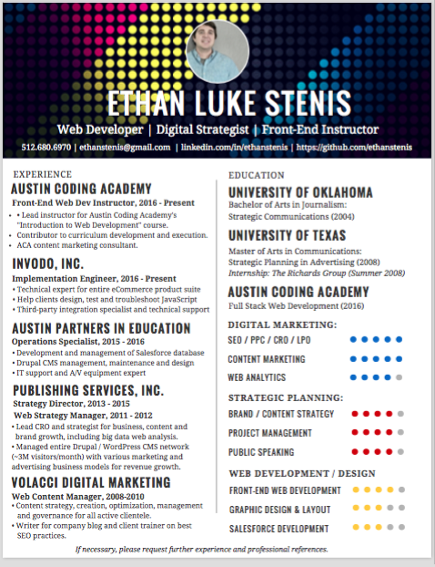
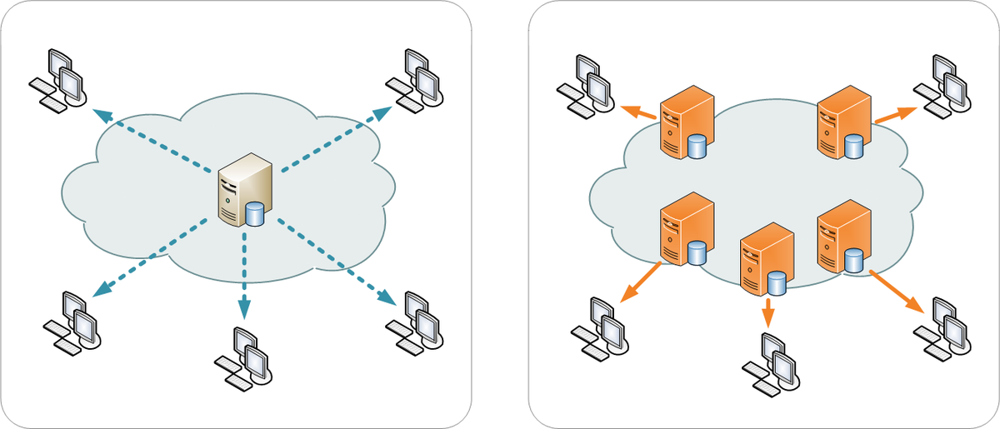

Hand out printed copies of the Developer Resume and pens so attendees can wireframe/diagram h1's, p's, ul's, etc.
Hand out printed cheatsheets of the HTML and CSS terms, tags, elements.

# Intro to Web Dev


---
## Welcome!

Below you will find written instructions for the Intro to Web Dev event.

Instructors will be moving at a leisurely pace, but if you'd like to have a visual reference, this is the place!

---
### Environment Setup

We'll be using Codepen today, which is a tool we use with our students to understand concepts before hardcoding.

No need to download anything today.

---
### Structure of this Meetup

* Meet and Greet
* Ice Breaker
* Coding Lesson
* Presentations


---
### Objectives

* Learn about the basic building blocks of web apps
* Experience a Learning Team environment
<!-- * Understand the benefits of the Iterative Design Process -->


---
### Key Questions

* What does the browser do?
* What are HTML and CSS and how do they relate to each other?
* How does a website work?
* Can I create a website?


---
### Project

Most of you are interested in a new career, so today we're going to create a resume page for an online Portfolio with the skills you'll have as a web developer.

Today the resume will be modeled after
 * A UX designer
 * One of our graduates who became an Instructor

We will leverage
 * Experience / Previous employment
 * Education
 * Portfolio of apps / sites
 * Languages / Frameworks
 * Tools / Software
 * Development Processes
 * Development / Design Team experience
 * Soft skills

Extension - Host your web page on gh-pages


<!--## Learning Teams & Iterative Design

We’re going to be partnering up today, so please sit a little closer to your partner. You should be able to see their computer screen clearly.

Your support network here today will resemble the Learning Teams we have in our Intro classes, which are based on Agile Development teams.

Many people still believe the tropes about developers sitting in a basement or a van, eating HotPockets and drinking Mountain Dew.

In reality, teams of developers, designers, marketers, salespeople, accountants, and managers all work together to create products and features using iterative design cycles. This process involves testing features and acting on customer feedback.

Ever seen the apps on your phone ‘updating’? That’s Iterative Design and Agile Development teams using feedback from real customers to create new and enjoyable experiences.

Paired programming is one of the most effective ways that Iterative Design teams and web developers learn, so we'll be working with partners today and iterating through our designs to optimize for increasingly better user experience. -->


---
## Creating a web page

Modern browsers read ‘code’ from servers to create web pages that you see on your computer using commands written in HTML, CSS, and Javascript.

Most developers use Chrome, but some others you might be familiar with are Safari and Internet Explorer.

1. The browser reads and readys the HTML (content - words, images) using semantic tags
1. The browser uses CSS to style the content (sizing, colors, spacing, alignment, etc)
1. The browser ‘renders’ the formatted content on our computer screens
1. Javascript makes the page dynamic (but we won’t be using JS quite yet)


---
## HTML


[HyperText Markup Language (HTML)](https://en.wikipedia.org/wiki/HTML) is the standard markup language for creating web pages and web applications.

With Cascading Style Sheets (CSS), and JavaScript, it forms a triad of cornerstone technologies for the World Wide Web.

Web browsers receive HTML documents from a webserver or from local storage and render them into multimedia web pages.

HTML describes the structure of a web page semantically and originally included cues for the appearance of the document.

Semantics means that tags are named after things humans are already familiar with.

For example, `<h1>` is based on the word "heading", just like in a newspaper, which _most_ humans have seen before.

#### HTML element structure


Think of these tags as wrappers directing the browser to display the tags' contents in a certain way.

>"Treat this text as a paragraph. Start here, `<p>` and stop here `</p>`."


##### Examples
```html
<h1>This is the largest heading</h1>
<p>This is a paragraph</p>
<a href="https://www.google.com">This is a link to Google</a>
```

#### Common Tags

| Tags | Meaning |
| ---- | ------- |
| `<h1></h1>` | Largest Heading |
| `<h2></h2>` | Second Largest Heading |
| `<h3></h3>` | Medium Heading |
| `<h4></h4>` | Smaller Heading |
| `<h5></h5>` | Smallest Heading |
| `<p></p>` | Paragraph |
| `<ul></ul>` | Unordered List |
| `<li></li>` | List Item |
| `<a href=""></a>` | Link anchor |
| `` | Image |

The `` needs a `src` attribute to provide the image we want to display, written as ``.

In a similar fashion, the anchor tag `<a>` needs a `href` attribute - a _**h**ypertext **ref**erence_ - if we want it to link to another location.

---
### Semantic Elements

A _semantic_ element clearly describes its meaning to both the browser and the developer.

One of the benefits of writing HTML semantically is that it's easy-to-use.

The use of semantic HTML elements provides a developer the combined advantage of writing fewer attributes while avoiding inline styles. All of this makes your code less clumsy.

So whenever any future developers read or edit your code, they will have an easier time comprehending it since they won't have to waste time figuring out how it works.

Plus, your code will be more condensed - remember, shorter code executes _faster_.

### Sectioning using semantic elements


```html
<body>
  <header><h1>My Awesome Blog!</h1></header>
  <nav>Home<br>About<br>Events<br>Contact</nav>
  <main>
    <section>
      <h1>Posts</h1>
      <article>My First Post!</article>
      <article>My Second Post!</article>
      <article>My Third Post!</article>
    </section>
    <section>
      <h1>Calendar</h1>
      <table>...</table>
    </section>
  </main>
  <aside>You Win!!!</aside>
  <footer>© 2016 Austin Coding Academy</footer>
</body>
```

---
#### Semantic Elements

| Semantic Tags | Meaning |
| ---- | ------- |
| [`<header>`](https://developer.mozilla.org/en-US/docs/Web/HTML/Element/header) | a group of introductory or navigational aids. It may contain some heading elements but also other elements like a logo, wrapped section's header, a search form, and so on |
| [`<nav>`](https://developer.mozilla.org/en-US/docs/Web/HTML/Element/nav) | section of a page that links to other pages or to parts within the page: a section with navigation links |
| [`<main>`](https://developer.mozilla.org/en-US/docs/Web/HTML/Element/main) | main content of  the <body> of a document or application. The main content area consists of content that is directly related to, or expands upon the central topic of a document or the central functionality of an application |
| [`<section>`](https://developer.mozilla.org/en-US/docs/Web/HTML/Element/section) | generic section of a document, i.e., a thematic grouping of content, typically with a heading. Each `<section>` should be identified, typically by including a heading (`<h1>`-`<h6>` element) as a child of the `<section>` element |
| [`<article>`](https://developer.mozilla.org/en-US/docs/Web/HTML/Element/article) | self-contained composition in a document, page, application, or site, which is intended to be independently distributable or reusable |
| [`<aside>`](https://developer.mozilla.org/en-US/docs/Web/HTML/Element/aside) | section of the page with content connected tangentially to the rest, which could be considered separate from that content. These sections are often represented as sidebars or inserts |
| [`<footer>`](https://developer.mozilla.org/en-US/docs/Web/HTML/Element/footer) | nearest sectioning content or sectioning root element. A footer typically contains information about the author of the section, copyright data or links to related documents |

<!-- ### `<h1>`s within `<section>`s
A `<h1>` tag should be used to name what the content in the current sectional semantic element is about. It will auto adjust with the amount of nesting the section has. Notice what happens in the Codepen embedded below:

<p data-height="441" data-theme-id="0" data-slug-hash="OXZaLV" data-default-tab="html,result" data-user="mistakevin" data-embed-version="2" class="codepen" editable="true">See the Pen <a href="http://codepen.io/mistakevin/pen/OXZaLV/">OXZaLV</a> by Kevin Colten (<a href="http://codepen.io/mistakevin">@mistakevin</a>) on <a href="http://codepen.io">CodePen</a>.</p>
<script async src="//assets.codepen.io/assets/embed/ei.js"></script>

It's worth noting that this is **not** a semantically appropriate way of achieving this effect. As a rule of thumb, start with `h1` and work your way down to `h6`, using CSS to achieve the desired aesthetic effect. -->

### Other benefits
Many of us only consume the web through the web browser, but there is a significant portion of the world that does not.

Many users rely on screen readers,  monochrome displays or other assistant technologies.

Others will expect a page to be printer-friendly in order for it to be of any use.

In these cases we not only concern our design sensibilities with how content is presented, but with how it is _structured_.

We compose our HTML _semantically_ so that it renders accurately across a range of browsing platforms - even before adding any CSS styling.


<!-- ---
### Wireframe with your teammate(s)

Using a pen (or pencil) and the paper resume we handed out, let's see if we can identify all the elements we just learned about.

<section style="display:block; content:''; clear:both;">

  <section style="float: left; width: 50%;" id="wireframe_elements">

  <ul>
    <li>Sections</li>
    <li>Paragraphs</li>
    <li>Lists</li>
    <li>Images</li>
    <li>Links</li>
  </ul>

  </section>

  <section style="float: left; width: 50%;" id="wireframe_resumes">

    

    

    

  </section>
</section> -->


---  
#### Codepen of HTML code

  Click on the HTML button to see the code

  1. Let's add **Hobbies** and **References** sections to the Resume.
  1. Now include an unordered list  `<ul></ul>` in each new section.
  1. Nest some list items `<li></li>` in the unordered lists.


  <p data-height="965" data-theme-id="0" data-slug-hash="YZeYjV" data-default-tab="html,result" data-user="austincoding" data-embed-version="2" data-pen-title="YZeYjV" data-editable="true" class="codepen">See the Pen <a href="http://codepen.io/austincoding/pen/YZeYjV/">YZeYjV</a> by Austin Coding Academy (<a href="http://codepen.io/austincoding">@austincoding</a>) on <a href="http://codepen.io">CodePen</a>.</p>
<script async src="https://production-assets.codepen.io/assets/embed/ei.js"></script>


---
## CSS

Now for the fun part!

When a browser reads a style sheet, it will format the HTML document according to the information in the style sheet.

Our HTML and CSS codepens have already been attached, so we don't have to worry about that.

All we have to do is practice our CSS skills by making our not-yet-interesting Resume a little more friendly.

To do that, let's go over the basics of CSS.

Remember, CSS wants to target elements and sections in HTML, it just needs help understanding which elements and what we'd like those elements to look like.

---
### CSS Anatomy

CSS consists of 2 components: selector and declaration.
* **Selector** - selects the element to change
* **Declaration** - changes to style of the element

The declaration consists of 2 parts: a property and a value.
* **Properties** - indicates what you want to change (color, width, height, font, etc.)
* **Values** - specifies how it will change (color: blue, red, etc.)

<section style="margin-top: 50px;">
</section>


<section style="margin-bottom: 50px;">
</section>


---
### Class Selectors

You'll target an HTML class with a dot in CSS.

Many developers attach multiple classes to elements.

It's not uncommon to have three to eight classes attached to one element.

Each class can have many declarations.

HTML
```html
<div class="fancy">
  <p>I'm fancy!</p>
</div>

<div class="screen-wide  normal-height">
  <p>I'm a good photo!</p>
</div>
```

CSS
```css
.fancy {
  color: green;
}

.screen-wide {
  width: 100%;
  repeat: no-repeat;
}

.normal-height {
  background-size: auto;
}
```


---
### ID Selectors

You'll target an HTML id with a hashtag in CSS.

Many developers recommend using id's only once in a document.

Id's are commonly used for navigation.

HTML
```html
<section id="services">
  <h1>Services</h1>
</div>
```

CSS
```css
#services {
  text-align: center;
}
```


---
### Attribute Selectors
You are not restricted to the two special attributes, `class` and `id`. You can specify other attributes by using square brackets. Inside the brackets you put the attribute name, optionally followed by a matching operator and a value.

HTML
```html
<a disabled>I'm a disabled link!</a>

<input type="button">
```

CSS
```css
[disabled] {
  color: gray;
}

[type="button"] {
  font-size: 16px;
}
```


---
### Pseudo-class selectors
A CSS [pseudo-class](https://developer.mozilla.org/en-US/docs/Web/CSS/Pseudo-classes) is a keyword added to selectors that specifies a special state of the element to be selected. For example `:hover` will apply a style when the user hovers over the element specified by the selector. These selectors are are not explicitly written in HTML, but are _always_ just there, and are only captured in CSS.

```css
selector:pseudo-class {
  property: value;
}
```

<p data-height="235" data-theme-id="0" data-slug-hash="grVaJL" data-default-tab="html,result" data-user="mistakevin" data-embed-version="2" class="codepen">See the Pen <a href="http://codepen.io/mistakevin/pen/grVaJL/">grVaJL</a> by Kevin Colten (<a href="http://codepen.io/mistakevin">@mistakevin</a>) on <a href="http://codepen.io">CodePen</a>.</p>
<script async src="//assets.codepen.io/assets/embed/ei.js"></script>


---
### Codepen

Click the CSS button of the Codepen

<p data-height="965" data-theme-id="0" data-slug-hash="YZeYjV" data-default-tab="html,result" data-user="austincoding" data-embed-version="2" data-pen-title="YZeYjV" data-editable="true" class="codepen">See the Pen <a href="http://codepen.io/austincoding/pen/YZeYjV/">YZeYjV</a> by Austin Coding Academy (<a href="http://codepen.io/austincoding">@austincoding</a>) on <a href="http://codepen.io">CodePen</a>.</p>
<script async src="https://production-assets.codepen.io/assets/embed/ei.js"></script>


---
#### Let's add some styles to our sections using common attributes...

For example, to center the content inside a specific section, apply this to the section using the section's id (#)

```css
#accolades {
  text-align: center;
}
```


---
### Cheatsheet


---
### Greg HTML

```html

<!DOCTYPE HTML PUBLIC "-//W3C//DTD HTML 4.01 Transitional//EN"><html><head><META http-equiv="Content-Type" content="text/html; charset=utf-8"></head><body>

<div>
  <div>
  	<div>
  		<div>
  			
  		</div>

  		<div>
  			<h1>Farmer Joe</h1>
  			<h2>Farmer</h2>
  		</div>

  		<div>
  			<ul>
  				<li>e: <a href="mailto:farmerjoe@farms.com" target="_blank">farmerjoe@farms.com</a></li>
  				<li>w: <a href="http://www.FarmersSite.com/" target="_blank">www.FarmersSite.com</a></li>
  				<li>m: 0123456789</li>
  			</ul>
  		</div>

  		<div>
      </div>
  	</div>

  	<div>
				<div>
					<h1>Objective</h1>
				</div>
				<div>
					<p>Seeking a strong and respectable position in operations management in an upcoming organization.</p>
				</div>

  			<div>
        </div>

  			<div>
  				<h1>Work Experience</h1>
  			</div>

  			<div>
  					<h2>Assistant Plant Manager</h2>
  					<p>Tyler, Texas</p>
  					<p>Oversee all the aspects of the organization including profit and loss as well as budget. Manage 600+ employers over four shifts in an entire day.</p>

  					<h2>Plant Superintendent</h2>
  					<p>Little Rock, AR</p>
  					<p>Directly responsible for all phases of production over an eight department complex. Oversee 250+ employees. Coordinate production with sales department. Handle U.S.D.A relations while maintaining high yield.</p>
  			</div>

  			<div>
        </div>

  			<div>
  				<h1>Key Skills</h1>
  			</div>

  			<div>
  				<ul>
  				<li>Reduced turnover rate by 15%</li>
  					<li>Managed a crew of 60 people.</li>
  					<li>Increased line efficiency by 25%</li>
  					<li>Implement sanitation inspection</li>
  				</ul>
  			</div>

  			<div>
        </div>

  			<div>
  				<h1>Education</h1>
  			</div>

  			<div>
  					<h2>Bachelors Degree - Poultry Science - University of Arkansas</h2>
  					<p>Qualification</p>
  					<p>Description</p>
  			</div>

  			<div>
        </div>

  	</div>
  </div>
</div>
```

---
### Greg CSS

```css
html,body,div,span,object,iframe,h1,h2,h3,h4,h5,h6,p,blockquote,pre,abbr,address,cite,code,del,dfn,em,img,ins,kbd,q,samp,small,strong,sub,sup,var,b,i,dl,dt,dd,ol,ul,li,fieldset,form,label,legend,table,caption,tbody,tfoot,thead,tr,th,td,article,aside,canvas,details,figcaption,figure,footer,header,hgroup,menu,nav,section,summary,time,mark,audio,video {
border:0;
font:inherit;
font-size:100%;
margin:0;
padding:0;
vertical-align:baseline;
}

article,aside,details,figcaption,figure,footer,header,hgroup,menu,nav,section {
display:block;
}

html, body {background: #181818; font-family: 'Lato', helvetica, arial, sans-serif; font-size: 16px; color: #222;}

.clear {clear: both;}

p {
	font-size: 1em;
	line-height: 1.4em;
	margin-bottom: 20px;
	color: #444;
}

#cv {
	width: 90%;
	max-width: 800px;
	background: #f3f3f3;
	margin: 30px auto;
}

.mainDetails {
	padding: 25px 35px;
	border-bottom: 2px solid #cf8a05;
	background: #ededed;
}

#name h1 {
	font-size: 2.5em;
	font-weight: 700;
	font-family: 'Rokkitt', Helvetica, Arial, sans-serif;
	margin-bottom: -6px;
}

#name h2 {
	font-size: 2em;
	margin-left: 2px;
	font-family: 'Rokkitt', Helvetica, Arial, sans-serif;
}

#mainArea {
	padding: 0 40px;
}

#headshot {
	width: 12.5%;
	float: left;
	margin-right: 30px;
}

#headshot img {
	width: 100%;
	height: auto;
	-webkit-border-radius: 50px;
	border-radius: 50px;
}

#name {
	float: left;
}

#contactDetails {
	float: right;
}

#contactDetails ul {
	list-style-type: none;
	font-size: 0.9em;
	margin-top: 2px;
}

#contactDetails ul li {
	margin-bottom: 3px;
	color: #444;
}

#contactDetails ul li a, a[href^=tel] {
	color: #444;
	text-decoration: none;
	-webkit-transition: all .3s ease-in;
	-moz-transition: all .3s ease-in;
	-o-transition: all .3s ease-in;
	-ms-transition: all .3s ease-in;
	transition: all .3s ease-in;
}

#contactDetails ul li a:hover {
	color: #cf8a05;
}


section {
	border-top: 1px solid #dedede;
	padding: 20px 0 0;
}

section:first-child {
	border-top: 0;
}

section:last-child {
	padding: 20px 0 10px;
}

.sectionTitle {
	float: left;
	width: 25%;
}

.sectionContent {
	float: right;
	width: 72.5%;
}

.sectionTitle h1 {
	font-family: 'Rokkitt', Helvetica, Arial, sans-serif;
	font-style: italic;
	font-size: 1.5em;
	color: #cf8a05;
}

.sectionContent h2 {
	font-family: 'Rokkitt', Helvetica, Arial, sans-serif;
	font-size: 1.5em;
	margin-bottom: -2px;
}

.subDetails {
	font-size: 0.8em;
	font-style: italic;
	margin-bottom: 3px;
}

.keySkills {
	list-style-type: none;
	-moz-column-count:3;
	-webkit-column-count:3;
	column-count:3;
	margin-bottom: 20px;
	font-size: 1em;
	color: #444;
}

.keySkills ul li {
	margin-bottom: 3px;
}

@media all and (min-width: 602px) and (max-width: 800px) {
	#headshot {
		display: none;
	}

	.keySkills {
	-moz-column-count:2;
	-webkit-column-count:2;
	column-count:2;
	}
}

@media all and (max-width: 601px) {
	#cv {
		width: 95%;
		margin: 10px auto;
		min-width: 280px;
	}

	#headshot {
		display: none;
	}

	#name, #contactDetails {
		float: none;
		width: 100%;
		text-align: center;
	}

	.sectionTitle, .sectionContent {
		float: none;
		width: 100%;
	}

	.sectionTitle {
		margin-left: -2px;
		font-size: 1.25em;
	}

	.keySkills {
		-moz-column-count:2;
		-webkit-column-count:2;
		column-count:2;
	}
}

@media all and (max-width: 480px) {
	.mainDetails {
		padding: 15px 15px;
	}

	section {
		padding: 15px 0 0;
	}

	#mainArea {
		padding: 0 25px;
	}


	.keySkills {
	-moz-column-count:1;
	-webkit-column-count:1;
	column-count:1;
	}

	#name h1 {
		line-height: .8em;
		margin-bottom: 4px;
	}
}

@media print {
    #cv {
        width: 100%;
    }
}

```


<section style="margin-top: 100px;">
</section>

<!-- <section style="display:block; content:''; clear:both;">

  <section style="float: left; width: 50%; text-align: center;" id="learn_more">

    Like to know more?

    Tap the link below to find out if our classes are the next step on your journey to a new career.

  </section>

  <section style="float: left; width: 50%; text-align: center;" id="apply_now">

    Ready to apply?

    Hit the link to below to talk to one of our Admissions Advisors who can answer any questions you might have.

  </section>
</section>
 -->


---


---


<section style="display:block; content:''; clear:both;">

  <section style="float: left; width: 50%; text-align: center;" id="learn_more">

    <a href="https://austincodingacademy.com/" style="width: 30%; padding: 10px 50px; color: black; background-color: #84FFFF;">Learn More</a>

  </section>

  <section style="float: left; width: 50%; text-align: center;" id="apply_now">

    <a href="https://austincodingacademy.com/apply/" style="width: 30%; padding: 10px 50px; color: black; background-color: #64FFDA; ">Apply Now</a>

  </section>
</section>


<section style="margin-bottom: 600px;">
</section>


<!--

---
### Content

Using the wireframes as a reference

In our codepens (or Atom)
1. Nest your different content in `<section></section>` tags
1. Use id's to section your content into  
 * header
 * skills
 * languages
 * experience
 * education
 * tools


**Example**
 ```html
 <!DOCTYPE html>
 <html>
   <head>
     <title></title>
   </head>
   <body>
     <header>
      <h1>Your Name</h1>
      <h3>Web Developer</h3>
     </header>
     <section id="skills">
      <ul>
        <li></li>
        <li></li>
        <li></li>
        <li></li>
      </ul>
     </section>
   </body>
 </html>
 ```

Your previous experience is a springboard to your next career.

Let's highlight that with a sentence or some bullet points to show what we bring to the table besides our ideas, time, and resources.

Now let's add some content in between the tags.

* Your name
* Address
* Phone number
* We'll add a brief bio in a bit
* Languages
  * HTML
  * CSS
  * Javascript
  * jQuery
  *
 -->


# Making a Responsive Website

---
## Welcome!

Below you will find written instructions for the Making a Responsive Website event.

Instructors will be moving at a leisurely pace, but if you'd like to have a visual reference, this is the place!

---
### Environment Setup

Please make sure you've downloaded the software we'll be using today
* Download [Atom](https://atom.io/)
* Download [Chrome](https://www.google.com/chrome/browser/desktop/index.html)

Extension
* Download [iTerm2](https://www.iterm2.com/)
* Start [Github account](https://github.com/)


---
### Structure of Class

* Meet and Greet
* Ice Breaker
* Coding Lesson
* Presentations


---
### Objectives

* Learn about the basic building blocks of web apps
* Experience a Learning Team environment
* Understand the benefits of the Iterative Design Process


---
### Key Questions

* How do Responsive websites work?
* Can I create one?
* What is required to host/launch a site?


---
### Project

Most of you are interested in a new career, so today we're going to create a resume page for an online Portfolio with the skills you'll have as a web developer.

Today the resume will be modeled after
* A UX designer
* One of our graduates who became an Instructor

We will leverage
* Languages / Frameworks
* Portfolio of apps / sites
* Tools / Software
* Development Processes
* Development / Design Team experience
* Soft skills
* Experience / Previous employment
* Education

We want to highlight your new skills as a developer, so they go on top.

Extension - Host your web page on gh-pages

<!-- Larger Project w/ Iterations
1. Codepen  
 1. Showcase
 1. Get feedback
 1. Ideate
 1. Prototype using
1. Resume page based on UX and Stenis
 1. Showcase
 1. Get feedback
 1. Ideate
 1. Prototype using
1. Tone-C Personal Resume Page -->

---
### Learning Teams | Iterative Design

We’re going to be partnering up today, so please sit a little closer to your partner. You should be able to see their computer screen clearly.

Your support network here today will resemble the Learning Teams we have in our Intro classes, which are based on Agile Development teams.

Many people still believe the tropes about developers sitting in a basement or a van, eating HotPockets and drinking Mountain Dew.

In reality, teams of developers, designers, marketers, salespeople, accountants, and managers all work together to create products and features using iterative design cycles. This process involves testing features and acting on customer feedback.

Ever seen the apps on your phone ‘updating’? That’s Iterative Design and Agile Development teams using feedback from real customers to create new and enjoyable experiences.

Paired programming is one of the most effective ways that Iterative Design teams and web developers learn, so we'll be working with partners today and iterating through our designs to optimize for increasingly better user experience.


---
### Presentation Skills [Optional]

We will be presenting our work today, as well. This will help us practice getting feedback and iterate based on what we know works and doesn't.

Employers and hiring managers all agree that the most in-demand skill for developers is to have some presentation skill.


<section style="margin-bottom: 100px;">
</section>


# Portfolio | Resume page
---

This is one of our graduate's Portfolio site - [Gizemist](http://www.gizemist.com/).

<!-- Here's a PDF of a similar site we'll be creating today, using a responsive grid.

 -->


---
### Folder Structure

  1. Create a new folder on your desktop, and name it Portfolio
  1. Inside the Portfolio folder, create a file named index.html
  1. Inside the Portfolio folder, create a folder named images
  1. Inside the Portfolio folder, create a folder named css
  1. Inside the css folder, create a file called style.css


---
###  Coding a webpage

  1. Drag the Portfolio folder into the Atom icon on the bottom of your screen
  1. Open the index.html file
  1. Copy the following code and Paste it into your index.html file in Atom
   * Developers rarely start from scratch. They use prefabricated solutions with built in capabilities


```html
<!DOCTYPE html>
<html>
  <head>
    <meta charset="utf-8">
    <meta http-equiv="X-UA-Compatible" content="IE=edge">
    <meta name="viewport" content="width=device-width, initial-scale=1">

    <title>Portfolio</title>

    <!-- Bootstrap Framework -->
    <link href="https://maxcdn.bootstrapcdn.com/bootstrap/3.3.6/css/bootstrap.min.css" rel="stylesheet">
    <!-- Reference site: https://www.bootstrapcdn.com/ -->

    <!-- Developer Icons -->
    <link rel="stylesheet" href="https://cdn.rawgit.com/konpa/devicon/4f6a4b08efdad6bb29f9cc801f5c07e263b39907/devicon.min.css">
    <!-- Reference site: http://konpa.github.io/devicon/ -->

    <!-- FontAwesome Icons -->
    <script src="https://use.fontawesome.com/0751a07f97.js"></script>
    <!-- Reference site: http://fontawesome.io/icons/ -->

    <!-- Personal stylesheet -->
    <link rel="stylesheet" href="css/style.css"/>
  </head>
  <body>
    <!-- Enter your code here -->


    <!-- Your code ends here -->

  <!-- Bootstrap jQuery CDN -->
  <script src="https://ajax.googleapis.com/ajax/libs/jquery/1.12.4/jquery.min.js"></script>
  <!-- Bootstrap Javascript CDN -->
  <script src="https://maxcdn.bootstrapcdn.com/bootstrap/3.3.6/js/bootstrap.min.js"></script>
  </body>
</html>
```


---
#### Content Delivery Network

A CDN is a link that loads a lot of content from a series of servers into the your site with high availability and high performance.

You can see the CDN links above - Bootstrap, DeveloperIcons, and FontAwesome.

CDN's allow us to use links to databases and special keywords to add capabilities to sites. For example: responsiveness and icons.

CDN's do this by putting the content in many places (servers) at once, providing superior coverage to your users. [Deep Dive](https://www.incapsula.com/cdn-guide/what-is-cdn-how-it-works.html)




---
#### Grid Systems

Grid systems are in almost every web app there is.

They allow developers to make one site, not three, which **stacks its content instead of letting the content run off the side of the screen**, forcing users to scroll to the right.

Most grid systems, including Bootstrap, include a responsive, mobile-first fluid grid system that appropriately scales up to 12 columns according to the screen size.


---
#### Layouts

Grid systems are used for creating page layouts through a series of rows and columns that hold the content.

CDNs allow developers to use specific keywords to implement previously created CSS without having to write thousands of lines of CSS.


---
#### Bootstrap

We'll be using Bootstrap, the most popular responsive grid system.

[Bootstrap]

If you'd like to do a deep dive into what Bootstrap can do, hit [this link]((https://www.bootstrapcdn.com/)).


---
#### Sizing

We will be making three distinctions: phone(xs), tablet(sm), and laptop(md). Since we have 12 columns in our grid, we can make several combinations that add up to 12, for example:

<p data-height="504" data-theme-id="0" data-slug-hash="kXmVKp" data-default-tab="html,result" data-user="mistakevin" data-embed-version="2" data-editable="true" class="codepen">See the Pen <a href="http://codepen.io/mistakevin/pen/kXmVKp/">kXmVKp</a> by Kevin Colten (<a href="http://codepen.io/mistakevin">@mistakevin</a>) on <a href="http://codepen.io">CodePen</a>.</p>
<script async src="//assets.codepen.io/assets/embed/ei.js"></script>


---
#### Column sizes

By determining the number of columns for a specific screen size:
 * All the other screen sizes bigger than the one described will inherit that size
 * All the phone sized screens will be default to a 12 column width (full screen)

When you define a container element like a `div` with `class="col-sm-4"`, you are setting a container 4 columns wide for small, medium, and large screen sizes, but for phone screens, it will be 12 columns wide.

Let's copy and paste the following code into our HTML, in between the `<body>  </body>` tags.

```html
    <section id="hero">
      <div class="row text-center hero_text">
        <h1>First and Last Name</h1>
        <h4>Web Developer</h4>
      </div>
    </section>

    <section id="about">
      <div class="row">
        <h3 class="text-center">
          Employer's Needs and Goals
        </h3>
        <div class="value_to_company col-md-4 col-md-offset-2">
          <p>Spicy jalapeno bacon ipsum dolor amet turkey kevin burgdoggen doner, prosciutto biltong alcatra meatloaf tongue beef ribs tri-tip shankle cow. T-bone pork chop bacon .</p>
        </div>
        <div class="goals_within_company col-md-4">
          <p>Kielbasa turkey biltong turducken jerky sirloin. Shank pancetta ball tip frankfurter, tenderloin turducken leberkas kevin. Bresaola biltong jowl, short ribs ball tip pork belly.</p>
        </div>
      </div>
    </section>

    <section id="languages_skills">
      <div class="row">
        <h3 class="text-center">
          Skills
        </h3>
        <div class="text-center col-md-1 col-md-offset-2">
          <i class="devicon-html5-plain"></i>
        </div>
        <div class="text-center col-md-1">
          <i class="devicon-css3-plain"></i>
        </div>
        <div class="text-center col-md-1">
          <i class="devicon-javascript-plain"></i>
        </div>
        <div class="text-center col-md-1">
          <i class="devicon-jquery-plain"></i>
        </div>
        <div class="text-center col-md-1">
          <i class="devicon-github-plain"></i>
        </div>
        <div class="text-center col-md-1">
          <i class="devicon-nodejs-plain"></i>
        </div>
        <div class="text-center col-md-1">
          <i class="devicon-mongodb-plain"></i>
        </div>
        <div class="text-center col-md-1">
          <i class="devicon-react-plain"></i>
        </div>
      </div>
    </section>

    <section id="portfolio">
      <div class="row">
        <h3 class="text-center">
          Portfolio
        </h3>
        <!-- Add 3 images and a title for each project -->
        <div class="">
          <h4> </h4>
          
        </div>
        <div class="">
          <h4> </h4>
          
        </div>
        <div class="">
          <h4> </h4>
          
        </div>
      </div>
    </section>

    <section id="testimonial">
      <div class="row">
        <h3 class="text-center">
          Testimonial
        </h3>
        <div class="col-md-6 col-md-offset-3">
          <p>
            Kielbasa turkey biltong turducken jerky sirloin. Shank pancetta ball tip frankfurter, tenderloin turducken leberkas kevin. Bresaola biltong jowl, short ribs ball tip pork belly. Spicy jalapeno bacon ipsum dolor amet turkey kevin burgdoggen doner, prosciutto biltong alcatra meatloaf tongue beef ribs tri-tip shankle cow. T-bone pork chop bacon .
          </p>
        </div>
      </div>
    </section>

    <section id="contact">
      <div class="row">
        <h3 class="text-center">
          Contact
        </h3>
        <!-- Use FontAwesome to add extra-large Email, LinkedIn, Github, Facebook icons -->
        <div class="">

        </div>
        <div class="">

        </div>
        <div class="">

        </div>
        <div class="">

        </div>
      </div>
    </section>
```
<section style="margin-bottom: 50px;">
</section>

**Instructor to explain code above**


---
#### Directions

Recreate the PDF above, using your knowledge of HTML, CSS, the Bootstrap Grid System, and the DevTool.

1. Follow the examples on the [Bootstrap page](https://www.bootstrapcdn.com/)
1. Use the HTML classes named specifically to allow developers to call the CSS classes necessary. We don't want to have to write all that CSS!

I'll show you how
1. Watch me first
1. Let's do it together
1. Try it by yourselves, in teams

Instructor will be walking around to assist


---
#### Copy

Directions : Find copy on the Internet to use as copy in your 'About' section


---
#### Using Icons with a CDN

Directions : Find and use the code to enlarge the Developer icons

Let's go to the webpages where we got our Icon CDNs. That's where we'll find the code and keywords we need to plug into our site.

[Developer Icons](http://konpa.github.io/devicon/)

[Font Awesome](http://fontawesome.io/icons/)


---
#### CSS

Find and download images to use in your CSS.

Remember :
 * Set heights for background images


---
#### Bonus - Host your own work!

1. Make an account on https://github.com
1. Verify your email
1. Create a new repository using your username called `<your username here>.github.io`
1. click "include a README", name it `index.html`, copy/paste your code, and commit.
1. Visit `<your username here>.github.io` on your phone! You're a Web Developer now!
1. Tell literally everybody at least twice.


# Iterative Design [Extension]
---
<!-- Larger Project w/ Iterations
1. Codepen  
  1. Showcase
  1. Get feedback
  1. Ideate
  1. Prototype using
1. Resume page based on UX and Stenis
  1. Showcase
  1. Get feedback
  1. Ideate
  1. Prototype using
1. Tone-C Personal Resume Page -->

### Demo of Stage 1

All of our work today is in its beginning stages.

That's the perfect environment for receiving feedback.

It allows us to understand what's valuable to our User, and build only those marketable features.

This eliminates wasted effort and resources. This practice is called Lean, and at its heart is Iterative Design.

Many freelancers, corporations, entrepreneurs, and startups build products and features this way.

Let's go around the room to showcase some of your products.

We're asking for feedback about our formatting, specifically, to take us to next part of the lesson.

---
### Feedback

---
### Break

If you'd like to take a 5 minute break, please do so.

We'll be walking around to assist and answer questions.

### CSS
---
Now that we've gotten some feedback, let's dive into CSS so we can create a better experience for our readers.

In our root folder, let's create a CSS folder and style.css file.

Let's link our HTML and CSS

### Demo of Stage 2


---


---


<section style="margin-bottom: 600px;">
</section>


# MVC Architecture
---


> This looks very complicated!

Another way to think of this would be

* View is your table at a restaurant
* Controller is the waiter
* Model is the chef
* Database is the uncooked food
* Your desired webpage is the meal


1. You order a **meal** (Webpage) from the **waiter** (Controller)
1. The **waiter** (Controller) knows how to interpret your words into the shorthand that the **chef** (Model) will use
1. The **waiter** (Controller) gives your order to the **chef** (Model)
1. The **chef** (Model) knows what **food** (Data) to get and how to prepare it
1. The **chef** (Model) gives the **prepared meal** (Webpage) to the **waiter** (Controller)
1. The **waiter** (Controller) then serves your **meal** (Webpage) to your **table** (View), as ordered

Now imagine you could order from any kitchen in the world from the comfort of your couch...

That's the internet. That's how MVC architecture and web apps work.

> Here's an example of a simple full stack application - a To Do list

> [MVC Demo - To Do List](http://todomvc.com/examples/react/#/)

> Try typing in some of the things you need to do this week.

<section style="margin-bottom: 600px;">
</section>


# Environment Setup / Prep for Success
---
Install the tech professional web developers use
* Chrome
 * Devtool
 * Bookmarking in Folders
* Atom
 * live-server
 * beautify
* Github
* iTerm2
* Trello


How to learn many difficult things quickly
* Synthesize using Trello Visual Vocabulary
 * Terms
 * Cheatsheets
 * Shortcuts

* Google Slides
 * Processes

* Gitbook
 * Processes
