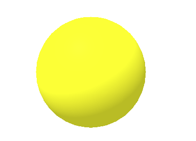
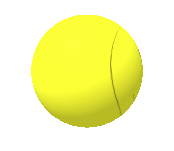
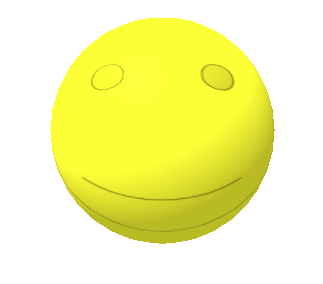
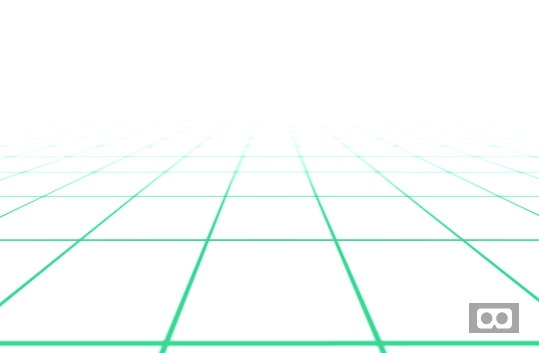
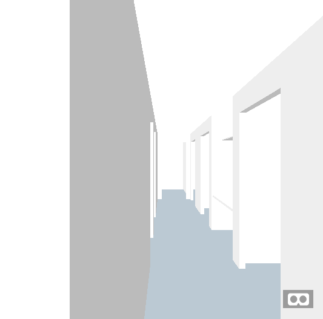
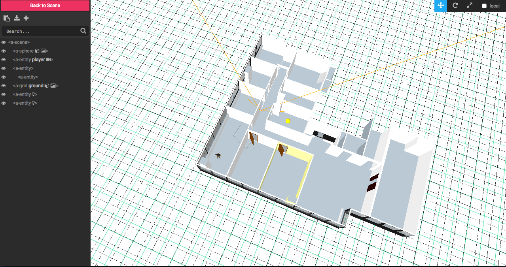



# WebVR 101

## What is WebVR?
> [WebVR](webvr.info) is an experimental JavaScript API that provides access to
  Virtual Reality devices, such as the Oculus Rift, HTC Vive, Samsung Gear VR,
  or Google Cardboard, in your browser.

## Where does WebVR work?
Anywhere with a modern browser! While you can view the Virtual Reality "scene"
on your desktop or computer, its interactivity really shines with the
devices mentioned above, and even on your smartphone!


## Where did it come from?

### WebGL (2009)
The platform for WebVR is the browser, such as Safari, Chrome, Firefox, etc. The
browser is only capable of reading three languages: HTML, CSS, and JavaScript.
Lately, most of the popular browsers have implemented a new JavaScript feature called
[WebGL](https://developer.mozilla.org/en-US/docs/Web/API/WebGL_API), which allows
your browser to render 2D and 3D scenes by tapping into your device's hardware (think CPU,
RAM, etc).

### three.js (2010)
WebGL was a huge feature for JavaScript, and [three.js](https://threejs.org/),
among [others](https://en.wikipedia.org/wiki/Three.js#Overview), came along to
help developers build with the WebGL API more easily.

### A-Frame (2015)
From three.js, other projects sprouted up offering frameworks to further help
developers get more done with less effort. One such framework is
[A-Frame](https://aframe.io/), which we will be using today.

## Let's get to work

### 1. Project Setup
1. It's recommended to use a code editor such at [Atom](atom.io) for macOS or Windows, or [Caret](https://chrome.google.com/webstore/detail/caret/fljalecfjciodhpcledpamjachpmelml?hl=en) for Chromebooks.

1. Create a text file called `index.html` on your desktop.

1. Open it up with your code editor and paste this template into it.
  ```html
  <!DOCTYPE html>
  <html>
    <head>
      <meta charset="utf-8">
      <title>My first WebVR Project!</title>
      <script src="https://aframe.io/releases/0.5.0/aframe.min.js"></script>
    </head>
    <body>

    </body>
  </html>
  ```

1. Open the file up in your browser. You should see a whole lot of nothing.

### 2. Let's build a `scene`

1. In your template, add as `<a-scene>` tag
  ```html
  <!DOCTYPE html>
  <html>
    <head>
      <meta charset="utf-8">
      <title>My first WebVR Project!</title>
      <script src="https://aframe.io/releases/0.5.0/aframe.min.js"></script>
    </head>
    <body>
      <a-scene>

      </a-scene>
    </body>
  </html>
  ```
  Refresh your browser and now you should see a little pair of goggles. Good!

  

1. Baller, shot caller! Let's add a `<a-sphere>`
  ```html
  <!DOCTYPE html>
  <html>
    <head>
      <meta charset="utf-8">
      <title>My first WebVR Project!</title>
      <script src="https://aframe.io/releases/0.5.0/aframe.min.js"></script>
    </head>
    <body>
      <a-scene>
        <a-sphere
          color="yellow"
        ></a-sphere>
      </a-scene>
    </body>
  </html>
  ```
  Now refresh the the browser. AAnnndd we see..nothing! WTF? Try backing up with
  the arrow keys. The ball should come into view. We were standing on it!

  

### 3. Position Yo Self


The reason the ball started out under us was because we all start out at `position="0 0 0"`,
even shapes. When we backed up, we increased our `z` position which
put our sphere out in front. Now instead of us having to move back (your audience might
not know to do that) let's push the sphere forward by assigning it a negative `z` value, and maybe a little up by increasing the `y`

```html
<!DOCTYPE html>
<html>
  <head>
    <meta charset="utf-8">
    <title>My first WebVR Project!</title>
    <script src="https://aframe.io/releases/0.5.0/aframe.min.js"></script>
  </head>
  <body>
    <a-scene>
      <a-sphere
        position="0 2 -3"
        color="yellow"
      ></a-sphere>
    </scene>
  </body>
</html>
```

### 4. Adding Some Texture
If we were just building a VR [Ball Pit](https://www.google.com/search?tbm=isch&q=ball%20pit&tbs=imgo:1),
solid color spheres would be perfect. But you'll probably want to add some texture
at some point, or at the least an image, to add some flair.

First, we add an `<a-assets></a-assets>` element to our `scene`. Then inside,
we can link to an image and give it an `id`
```html
<a-assets>
  
</a-assets>
```

then on our `a-sphere` we can add a `material` attribute linking to that `id`

```html
<a-sphere
  material="src: #smile"
  position="0 2 -3"
  color="yellow"
></a-sphere>
```


Boom! We have a creepy smiley face giving us the cold shoulder. Let's rotate it towards us.

### 5. Rotation


```html
<a-sphere
  material="src: #smile"
  position="0 2 -3"
  color="yellow"
  rotation="0 -90 0"
></a-sphere>
```


## Importing 3D Models
Building models from scratch is fun, but we can get some real work down importing
3D models from other software. [SketchUp](https://www.sketchup.com/) is one such software
where you are only limited by your imagination. While building in SketchUp is beyond
the scope of the workshop, we can play around with models others have created!
[3D Warehouse](https://3dwarehouse.sketchup.com/) is a repository of models built
by designers, architects, and enthusiasts. From here we can download a COLLADA
file and import it into our scene. Let's use this COLLADA file as an demo.

### Show me the `grid`
Let's start by:
1. adding two shiny new libraries
1. hiding the smiley sphere for now,
1. giving ourselves a nice little `static` `grid` to stand on

```html
<!DOCTYPE html>
<html>
  <head>
    <meta charset="utf-8">
    <title>My first WebVR Project!</title>
    <script src="https://aframe.io/releases/0.5.0/aframe.min.js"></script>
    <script src="https://cdn.rawgit.com/donmccurdy/aframe-extras/v3.2.7/dist/aframe-extras.min.js"></script>
    <script src="https://austincodingacademy.github.io/webvr/demo/automove-controls.js" charset="utf-8"></script>
  </head>
  <body>
    <a-scene>
      <a-assets>
        
      </a-assets>
      <!-- <a-sphere
        material="src: #smile"
        position="0 2 -3"
        color="yellow"
        rotation="0 -90 0"
      ></a-sphere> -->
      <a-grid static-body geometry="width:100; height: 100;"></a-grid>
    </scene>
  </body>
</html>
```


### I'm a `collada-model`
We should be able to walk around on a grid. Now let's pull in our 3D model
(downloaded from 3D Warehouse).

1. In your `a-assets` section add
```html
<a-asset-item id="doors" src="https://austincodingacademy.github.io/webvr/demo/model.dae"></a-asset-item>
```
this will load our model.

1. Now we can add the model to the `a-scene`
  ```html
  <a-entity position="-3 -1 5.5">
    <a-entity collada-model="#doors" position="0 1.1 0"></a-entity>
  </a-entity>
  ```

  Bam! An instant eerie hallway.

  


### Don't hate the player
But when we put the headsets on ourselves, (and on our friends, family, SXSW acquaintances, pets, etc)
we are going to want to move around, not just stand there goofing off. And did you know
there's a murderer in here! Get out! We've already included the script that allows
a `#player` to walk around, now we just need to put him in the `a-scene`

```html
<a-entity id="player"
  camera
  universal-controls="movementControls: automove, gamepad, keyboard"
  kinematic-body
  position="0 8 0"
></a-entity>
```

## Wrap up
Here is our final code
```html
<!DOCTYPE html>
<html>

<head>
  <meta charset="utf-8">
  <title></title>
  <script src="https://aframe.io/releases/0.5.0/aframe.min.js"></script>
  <script src="https://cdn.rawgit.com/donmccurdy/aframe-extras/v3.2.7/dist/aframe-extras.min.js"></script>
  <script src="https://austincodingacademy.github.io/webvr/demo/automove-controls.js" charset="utf-8"></script>
</head>

<body>
  <a-scene>
    <a-assets>
      <a-asset-item id="doors" src="https://austincodingacademy.github.io/webvr/demo/model.dae"></a-asset-item>
      
    </a-assets>
    <!-- <a-sphere
      material="src: #smile"
      position="0 2 -3"
      color="yellow"
      rotation="0 -90 0"
    ></a-sphere> -->
    <a-entity id="player"
      camera
      universal-controls="movementControls: automove, gamepad, keyboard"
      kinematic-body
      position="0 8 0"
    ></a-entity>
    <a-entity position="-3 -1 5.5">
      <a-entity collada-model="#doors" position="0 1.1 0"></a-entity>
    </a-entity>
    <a-grid id="ground" static-body geometry="width:100; height: 100;"></a-grid>
  </a-scene>
</body>
</html>
```

## Challenge - Let's play Find that Smile!
Let's uncomment our smiley ball, shrink it up a bit using the `radius` attribute, and use `position` to hide
it somewhere in the house. If you're really clever, you can figure out the bounds
of the building and try to randomize the `position` on load with JavaScript! Post your solutions and comments below!

hint: You can use the A-Frame Inspector by pressing `alt` + `control` + `i` to see a birdseye view of the
scene.



You can view the hosted solution [here](https://austincodingacademy.github.io/webvr//demo).
Try it out on your phone in your Cardboard!

Here is the [source](https://github.com/AustinCodingAcademy/webvr/tree/master/demo)

Want another? How about the [first level of DOOM](https://austincodingacademy.github.io/webvr/doom)!

[source](https://github.com/AustinCodingAcademy/webvr/tree/master/doom) | [credit](https://3dwarehouse.sketchup.com/model.html?id=a343ff4560eeee86134bb2d5b6773b)

## Bonus - Host your own work!

1. Make an account on https://github.com
1. Verify your email
1. Create a new repository using your username called `<your username here>.github.io`
1. click "include a README", name it `index.html`, copy/paste your code, and commit.
1. Visit `<your username here>.github.io` on your phone! You're a WebVR developer now!
1. Tell literally everybody at least twice.


