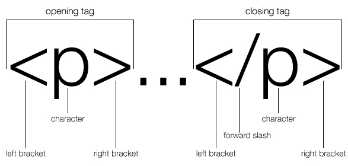

# Wine and Web

## Welcome!

Below you will find written instructions for the Wine and Web event.

We suggest that attendees read over these instructions as needed.

Instructors will be moving at a leisurely pace, but if you'd like to have a visual reference, this is the place!

### Structure of Class

* Meet and Greet
* Ice Breaker
* Coding Lesson
* Presentations

### Objectives

* Learn about the basic building blocks of web apps
* Experience a Learning Team environment
* Understand the benefits of the Iterative Design Process

### Key Questions

* What is a web application?
* What is MVC architecture?
* What does the browser do?
* What are HTML and CSS and how do they relate to each other?

### Project

* Create an resume with the skills you want to have

# Creating a web page

## MVC Architecture

This looks very complicated!

Another way to think of this would be

* View is your table at a restaurant
* Controller is the waiter
* Model is the chef
* Database is the food

You can order your food and
* the waiter (Controller) knows how to interpret your words into the shorthand that chefs (Model) use
* the waiter (Controller) gives your order to the chef
* the chef (Model) knows what food to get and how to prepare it
* the chef (Model) gives the prepared meal to the waiter (Controller)
* the waiter (Controller) then serves it to your table (View), as ordered

Now imagine you could order from any kitchen in the world from the comfort of your couch...

That's the internet.

That's how MVC architecture and web apps work.

#### Here's an example of a simple full stack application - a To Do list

[MVC Demo - To Do List](http://todomvc.com/examples/react/#/)

Try typing in some of the things you need to do this week.

## HTML

[HyperText Markup Language (HTML)](https://en.wikipedia.org/wiki/HTML) is the standard markup language for creating web pages and web applications.

With Cascading Style Sheets (CSS), and JavaScript, it forms a triad of cornerstone technologies for the World Wide Web.[1]

Web browsers receive HTML documents from a webserver or from local storage and render them into multimedia web pages.

HTML describes the structure of a web page semantically and originally included cues for the appearance of the document.

### HTML element structure

### HTML code

Now let us see what happens when we integrate some of the elements to our template. let's try adding the following:

* `<h1></h1>`
* `<h2></h2>`
* `<h3></h3>`
* `

`
* ``
* ``
* `

`
* `<section></section>`

### Content

Now let's add some content in between the tags.

Try adding
* Your name
* Address
* Phone number
* Brief bio
* Picture of yourself
* A website you like

### Presentations

All of our work today is in its beginning stages.

That's the perfect environment for receiving feedback.

It allows us to understand what's valuable to our User, and build only those marketable features.

This eliminates wasted effort and resources.

This practice is called Lean.

Many freelancers, corporations, entrepreneurs, and startups build features this way.

Let's go around the room to showcase some of your products.

We ask for feedback about our formatting, specifically, to take us to next part of the lesson.

### Feedback

### Break

### CSS

Now that we've gotten some feedback, let's dive into CSS so we can create a better experience for our readers.
